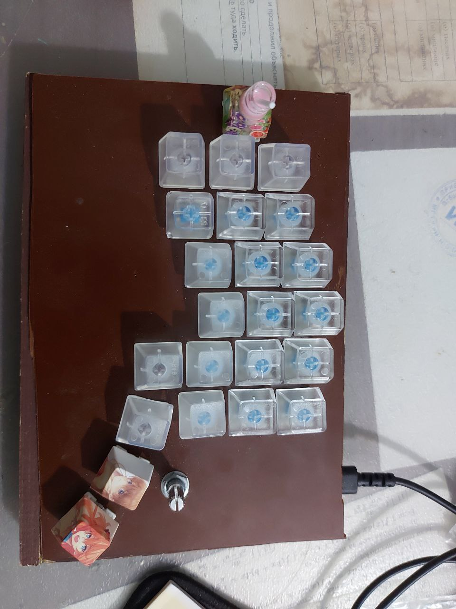
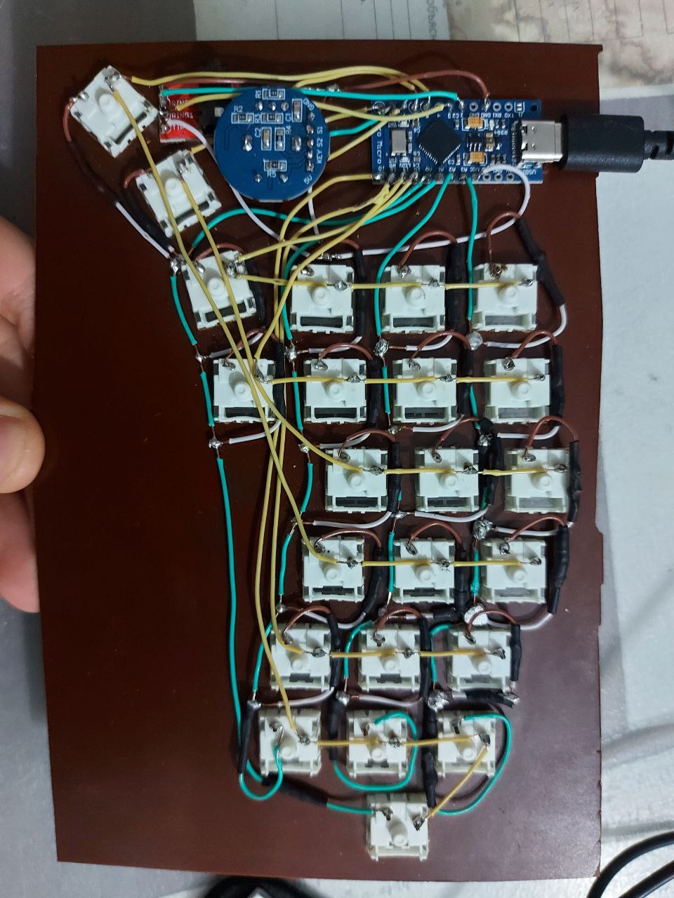

# Отчёт по домашнему заданию

## Цель работы:
Создание и програмного и аппаратного обеспечения ортлинейной сплит клавиатуры 

---

## Задание:
1. Моделирование клавиатуры
2. Сборка корпуса
3. Пайка кнопок, микроконтроллеров, импульсных диодов и энкодеров
4. Пограммирование микроконтроллеров

Код программы:

```c++
#include <Arduino.h>

#include <Wire.h> // I2C connection

#include <Keyboard.h> // 

#include <GyverIO.h> // for EncButton
#include <EncButton.h> // for buttons and encoder

#include "convertions.hpp"
#include "layers.hpp"


int layer = 0; // keyboard layer change by modifyer keys
bool wasPressed [24] = {0}; // all false
VirtButton GyvButtons[24];

EncButtonT<9, 8, 7> GyvEncoder;


#define IS_MASTER true

#if IS_MASTER
// master code

void scanKeyboard();

void pressButton(int num);
void releaseButton(int num);

void sendKeyboardToPC();


void setup()
{

  //green wires, 18 = A0, 21 = A3
  for (int i = 18; i < 22; ++i) {
    pinMode(i, OUTPUT);
    digitalWrite(i, HIGH);
  }

  //yellow wires
  for (int i = 0; i < 6; ++i) {
    pinMode(convertNumberToInputPin(i), INPUT_PULLUP);
  }

  Serial.begin(9600); //This pipes to the serial monitor
  Serial.println("Initialize Serial Monitor");

  Wire.begin();

  Keyboard.begin();
  initializeLayers(IS_MASTER);

  GyvEncoder.init();
}

void loop()
{
  //getButton();

  

  scanKeyboard();

  GyvEncoder.tick();

  //sendKeyboardToPC();

}


// get button from slave part
void getButton() {
  Wire.requestFrom(8, 5);

  while (Wire.available()) { // пока есть что считывать,
    int c = Wire.read();    // считываем,
    if (c != 0 && c != 255) {
      Serial.print(c);
      Serial.print(' ');
    }
  }

  delay(10);
}

/**
 * calls tick method for all keys and encoder on this keyboard part
 */
void scanKeyboard() {

  #if !IS_MASTER
  isButtonsTransportable = false; // lock buttons array for requestEvent
  #endif

  for (int output = 18; output < 22; ++output) {
    digitalWrite(output, LOW);
    for (int input = 0; input < 6; ++input) {

      if (!digitalRead(convertNumberToInputPin(input)) && (wasPressed[convertButton(output, input)] == false)) { // means that this key is pressed now
        //Serial.print(output); Serial.print(input);
        Serial.print("pressed button "); Serial.println(convertButton(output, input));
        wasPressed[convertButton(output, input)] = true;

        pressButton(convertButton(output, input));

      } else if (digitalRead(convertNumberToInputPin(input)) && (wasPressed[convertButton(output, input)] == true)) {
        Serial.print("released button "); Serial.println(convertButton(output, input));
        wasPressed[convertButton(output, input)] = false;

        releaseButton(convertButton(output, input));
      }

      GyvButtons[convertButton(output, input)].tick(digitalRead(convertNumberToInputPin(input)));
    }
    digitalWrite(output, HIGH);
  }

  //encoder button update
  //if (GyvEncoder.readBtn() && (wasPressed[4] == false)) { // means that this key is pressed now
  if (GyvEncoder.press()) {
    //Serial.print(output); Serial.print(input);
    Serial.print("pressed button "); Serial.println(4);
    wasPressed[4] = true;

    pressButton(4);

  }

  //Serial.println("checkKeyboard calls");

  #if !IS_MASTER
  isButtonsTransportable = true; // unlock buttons array for requestEvent
  #endif
}

void sendKeyboardToPC() {
  if(GyvButtons[0].press()) {Keyboard.press(layers[layer][0]);}
  if(GyvButtons[0].release()) {Keyboard.release(layers[layer][0]);}

  
}


void pressButton(int num) {
  Serial.print("pressed layered key: "); Serial.println(layers[0][num]);
  Keyboard.press(layers[0][num]);
} // 

void releaseButton(int num) {
  Keyboard.release(layers[0][num]);
}


#else
// slave code

/**
 * @par byteNum - the number of bytes read from the controller device)
 * 
 * @return nothing
*/
void receiveEvent(int byteNum);

void setup() {
  Wire.begin(8);                // запускаем шину с переметром 8, это номер нашего устройства
  Wire.onReceive(receiveEvent); // привязываем функцию, автоматически запускаемую при приеме данных
  Serial.begin(9600);           // запускаем сериал-порт для наблюдения за результатом в мониторе
}

void loop() {                   // главный цикл пуст
}

void receiveEvent(int byteNum) {            // функция, автоматически вызываемая при получении данных
  while (Wire.available()) {
    int c = Wire.read();
    if (c != 7) {

      Serial.print(c); Serial.print(' ');
    }
  }
}


#endif
```

## Полученный результат

---


---

## 

## Вывод:
В ходе выполнения лабораторной работы была разработана и запрограммирована ортолинейная сплит клавиатура
