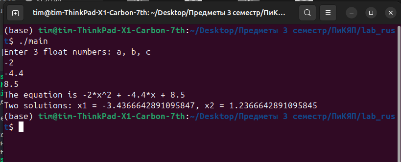

# Отчёт по лабораторной работе №1

## Цель работы:
Научиться разрабатывать программы для решения квадратных уравнений, используя язык программирования **Rust**. Закрепить навыки работы с вводом-выводом данных, ветвлениями (условными операторами) и обработкой числовых значений.

---

## Задание:
1. Написать программу, которая решает квадратное уравнение вида:
    a⋅x2+b⋅x+c=0a \cdot x^2 + b \cdot x + c = 0a⋅x2+b⋅x+c=0, где aaa, bbb, ccc — действительные числа.
    
    Программа должна:
    
    - Запрашивать у пользователя ввод коэффициентов aaa, bbb, ccc.
    
    - Определять, является ли уравнение линейным (a=0a = 0a=0) или квадратным (a≠0a \neq 0a=0).
    
    - В зависимости от значения дискриминанта 
    
      D=b2−4acD = b^2 - 4acD=b2−4ac
    
       находить корни уравнения:
    
      - Если D>0D > 0D>0, программа выводит два действительных корня.
      - Если D=0D = 0D=0, программа выводит один действительный корень.
      - Если D<0D < 0D<0, программа сообщает, что действительных корней нет.
    
    Обеспечить обработку ошибок при вводе некорректных данных.
    
    Форматировать результаты с двумя знаками после запятой.

---

## Код программы:
```rust
use std::io;

fn main() {
    // Request user input for the 
    println!("Enter 3 float numbers: a, b, c");
    let a = read_float();
    let b = read_float();
    let c = read_float();
    
    // Calculate the discriminant
    println!("The equation is {}*x^2 + {}*x + {}", a, b, c);
    if a == 0.0 {
        if b == 0.0 {
            println!("No real solutions.");
        } else {
            println!("One solution: x = {}", -1.0 * c / b);
        }
    } else {
        let discriminant = b * b - 4.0 * a * c;

        if discriminant > 0.0 {
            let x1 = (-b + discriminant.sqrt()) / (2.0 * a);
            let x2 = (-b - discriminant.sqrt()) / (2.0 * a);
            println!("Two solutions: x1 = {}, x2 = {}", x1, x2);
        } else if discriminant == 0.0 {
            let x = -b / (2.0 * a);
            println!("One solution: x = {}", x);
        } else {
            println!("No real solutions.");
        }
    }
}

fn read_float() -> f64{
    let mut input = String::new();
    io::stdin().read_line(&mut input).expect("Failed to read line");
    input.trim().parse().expect("Please enter a valid number")
}
```

## Пример выполнения программы:

---

## Вывод:
В ходе выполнения лабораторной работы была разработана программа для решения квадратных уравнений. Были достигнуты следующие результаты:

1. Освоены навыки работы с **вводом-выводом данных** на языке Rust с использованием функции `io::stdin()`.
2. Реализована логика для проверки типа уравнения и вычисления корней в зависимости от значения дискриминанта.
3. Добавлена обработка ошибок ввода с помощью конструкции `match` для повторного запроса данных при некорректном вводе.
4. Программа корректно обрабатывает все возможные случаи:
   - Два корня при D>0D > 0D>0.
   - Один корень при D=0D = 0D=0.
   - Сообщение об отсутствии действительных корней при D<0D < 0D<0.
5. Результаты отображаются с точностью до двух знаков после запятой, что улучшает читаемость вывода.

Таким образом, была разработана программа, соответствующая поставленной задаче и требованиям лабораторной работы.
