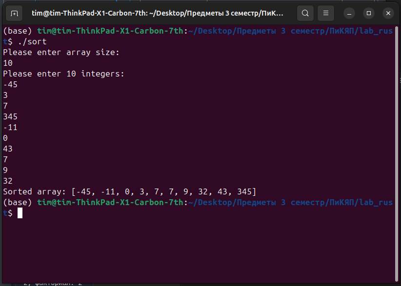

# Отчёт по лабораторной работе №2

## Цель работы:
Научиться разрабатывать программы для сортировки массива на языке **Rust**, используя ручной ввод данных и алгоритмы сортировки. Закрепить навыки работы с динамическими структурами данных (вектор `Vec`), циклами и операциями над массивами.

---

## Задание:
1. Написать программу, которая выполняет сортировку массива целых чисел по возрастанию методом **выбора** (Selection Sort).

   Программа должна:

   - Запрашивать у пользователя размер массива (целое число).
   - Вводить массив из указанного количества целых чисел.
   - Выполнять сортировку массива методом выбора:
     - На каждой итерации находить минимальный элемент из неотсортированной части массива и обменивать его с текущим элементом.
   - Выводить отсортированный массив.

   Обеспечить обработку ошибок при вводе некорректных данных.

---

## Код программы:
```rust
use std::io;

fn main() {
    println!("Please enter array size:");
    let mut input = String::new();
    io::stdin().read_line(&mut input).expect("Failed to read line");
    let size: usize = input.trim().parse().expect("Please enter a valid integer");
    
    let mut numbers = Vec::new();

    // Input 10 integers from the user
    println!("Please enter 10 integers:");

    for _ in 0..size { 
        let mut input = String::new();
        io::stdin().read_line(&mut input).expect("Failed to read line");
        let num: i32 = input.trim().parse().expect("Please enter a valid integer");
        numbers.push(num);
    }

    for i in 0..size {
        let mut min_index = i;
        for j in (i + 1)..size {
            if numbers[j] < numbers[min_index] {
                min_index = j;
            }
        }
        numbers.swap(i, min_index);
    }

    println!("Sorted array: {:?}", numbers);
}
```

## Пример выполнения программы

---

## Вывод:
В результате выполнения лабораторной работы была создана программа, демонстрирующая использование функций, циклов и условных конструкций в языке Rust. Программа позволяет автоматизировать вычисление факториалов, проверку чисел на простоту и нахождение простых чисел в диапазоне. Полученные навыки являются важными для написания более сложных приложений, использующих базовые алгоритмы обработки данных.
