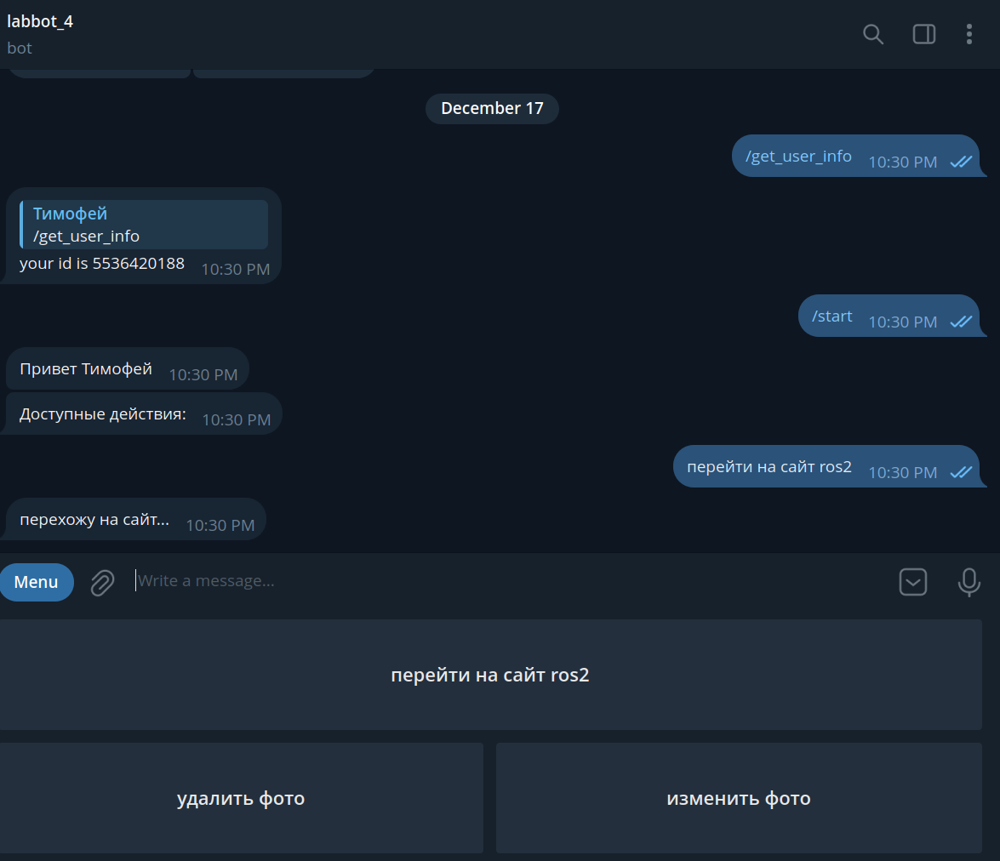
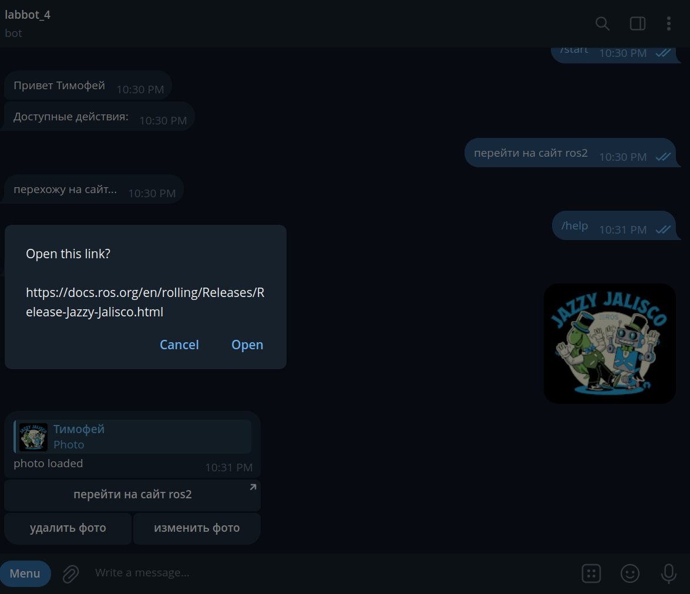

# Отчёт по лабораторным работам №3-4

## Цель работы:
Научиться разрабатывать и развертывать телеграм-ботов на языке **Python** с использованием библиотеки `pyTelegramBotAPI`. Закрепить навыки взаимодействия с Telegram API и настройки бота через **BotFather**, а также практиковать работу с обработкой текстовых сообщений, команд и медиафайлов.

---

## Задание:
1. **Создать телеграм-бота** с помощью BotFather:

   - Получить уникальный **токен доступа** для управления ботом.
   - Настроить бота: установить аватарку, добавить описание и приветственное сообщение, а также создать команды `/start` и `/help`.

   **Разработать функциональность бота**:

   - Реализовать обработку следующих команд:
     - `/start` — приветствие пользователя с отображением клавиатуры с кнопками.
     - `/help` — вывод справочной информации с использованием форматирования текста в HTML.
     - `/get_user_info` — вывод уникального идентификатора пользователя.
   - Обрабатывать текстовые сообщения:
     - Если пользователь отправляет "my id", бот должен вернуть ID пользователя.
   - Реализовать обработку фото:
     - После отправки изображения бот должен предложить действия с помощью инлайн-кнопок:
       - Перейти на сайт ROS 2.
       - Удалить фото.
       - Изменить текст под фото.
   - Реализовать обработку callback-событий от инлайн-кнопок:
     - Удаление изображения.
     - Изменение текста сообщения.

   **Запустить бота** с использованием метода `bot.polling()` для непрерывного опроса сервера.

   **Дополнительно**: Взаимодействовать с BotFather для детальной настройки бота:

   - Установить аватарку.
   - Добавить описание и краткую справку по боту.
   - Прописать команды `/start` и `/help` с описанием их функций.
   - Настроить приветственное сообщение при первом взаимодействии с ботом.

---

## Код программы:
```python
import telebot

bot = telebot.TeleBot('7827687652:AAGyNjGzZlCgW8OUdRSLxvAM5ykkfXmSRKg')

# all text exept commands


@bot.message_handler(commands=['start'])
def main(message):
    bot.send_message(message.chat.id, f'Привет {message.from_user.first_name}')

    markup = types.ReplyKeyboardMarkup()
    btn1 = types.KeyboardButton('перейти на сайт ros2')
    btn2 = types.KeyboardButton('удалить фото')
    btn3 = types.KeyboardButton('изменить фото')
    markup.add(btn1)
    markup.row(btn2, btn3)
    bot.send_message(message.chat.id, "Доступные действия:", reply_markup=markup)
    bot.register_next_step_handler(message, on_click)

def on_click(message):
    if message.text == 'перейти на сайт ros2':
        bot.send_message(message.chat.id, "перехожу на сайт...")
    else:
        bot.send_message(message.chat.id, "это сообщение пока не может быть обработано")


@bot.message_handler(commands=['help'])
def main(message):
    bot.send_message(message.chat.id, '<b>help</b> <u><em>info</em></u>',
                     parse_mode='html')
    print(message)

@bot.message_handler(commands=['get_user_info'])
def main(message):
    bot.reply_to(message, f"your id is {message.from_user.id}")
    print(message)

@bot.message_handler()
def info(message):
    if message.text.lower() == 'my id':
        bot.reply_to(message, f"your id is {message.from_user.id}")
        #process photo


from telebot import types

@bot.message_handler(content_types=['photo'])
def get_photo(message):
    markup = types.InlineKeyboardMarkup()

    btn1 = types.InlineKeyboardButton('перейти на сайт ros2', url='https://docs.ros.org/en/rolling/Releases/Release-Jazzy-Jalisco.html')
    btn2 = types.InlineKeyboardButton('удалить фото', callback_data='delete')
    btn3 = types.InlineKeyboardButton('изменить фото', callback_data='change')
    markup.add(btn1)
    markup.row(btn2, btn3)
    bot.reply_to(message, "photo loaded", reply_markup=markup)

@bot.callback_query_handler(func = lambda callback: True)
def callback_message(callback):
    print('callback works')
    if callback.data == 'delete':
        bot.delete_message(callback.message.chat.id, callback.message.message.id)
    elif callback.data == 'change':
        bot.edit_message_text('text edited', callback.message.chat.id, callback.message.message.id)


bot.polling(none_stop=True)
```

## Пример выполнения программы

---



## Вывод:
В ходе выполнения лабораторной работы был разработан и запущен телеграм-бот с базовым функционалом:

1. Создан и настроен бот с использованием **BotFather**:
   - Получен уникальный токен для доступа.
   - Установлены аватарка и описание бота.
   - Добавлены команды `/start` и `/help` с их функциональным назначением.
2. Разработан телеграм-бот на языке **Python** с использованием библиотеки `pyTelegramBotAPI`. Бот поддерживает:
   - Обработку текстовых команд и сообщений (например, "my id").
   - Отправку и взаимодействие с медиафайлами (фото).
   - Реализацию **инлайн-кнопок** для управления действиями (удаление фото, изменение текста, переход по ссылке).
   - Обработку **callback-событий** для выполнения конкретных действий (например, удаление сообщения или редактирование текста).
3. Благодаря взаимодействию с Telegram API и настройкой через **BotFather** были получены практические навыки разработки и тестирования ботов. Бот корректно реагирует на действия пользователя и демонстрирует базовые возможности Telegram для автоматизации взаимодействия с пользователями.

Таким образом, лабораторная работа позволила освоить основы разработки телеграм-ботов, их настройки и взаимодействия с пользователями, а также закрепить навыки работы с сетевыми запросами и библиотеками в **Python**.
