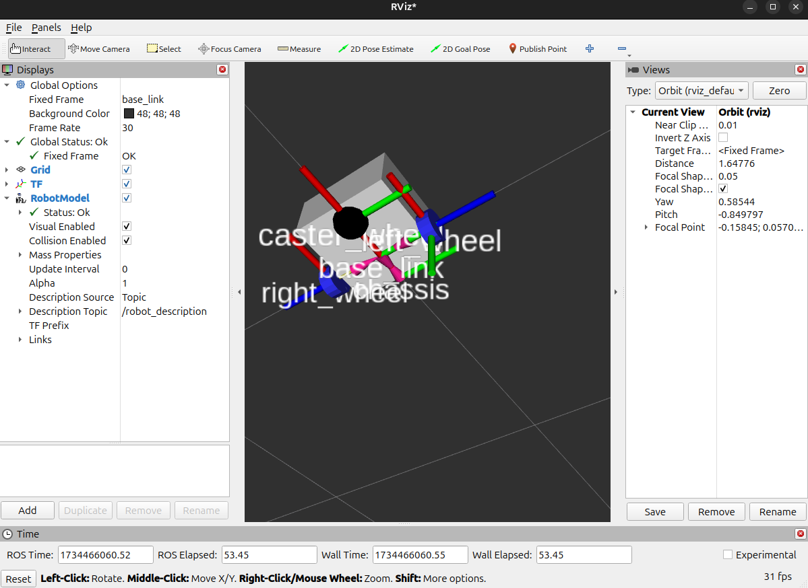
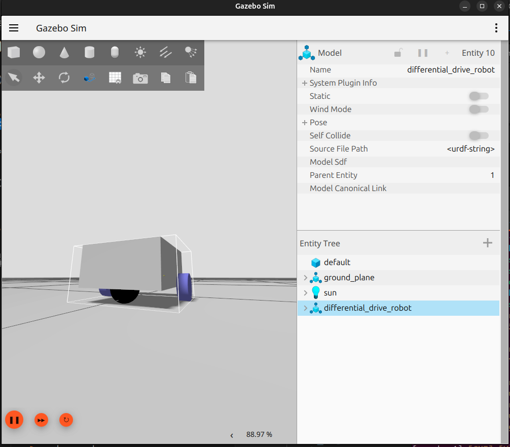

# Отчёт по лабораторным работам №5-6

## Цель работы
Научиться создавать и редактировать модели роботов с использованием **XACRO-файлов** для среды **ROS 2**. Ознакомиться с процессом моделирования двухколесной дифференциальной платформы, её визуализацией в **RViz2** и симуляцией движения робота в среде **Gazebo**.

## Задание
1. - **Создание модели робота**:

     - Разработать 
   
       XACRO-файл, описывающий двухколесную дифференциальную платформу с основными элементами:
   
       - База робота (корпус).
       - Два ведущих колеса.
       - Касторное колесо (опорное, пассивное).
       - Геометрические и физические свойства модели.
   
     **Запуск модели в симуляции**:
   
     - Конвертировать XACRO-файл в **URDF**-формат для дальнейшего использования.
     - Запустить и проверить отображение модели робота в **RViz2**.
     - Оценить правильность визуализации всех элементов модели, таких как колёса и корпус.
   
     **Симуляция в Gazebo**:
   
     - Запустить двухколесную дифференциальную платформу в симуляторе **Gazebo**.
     - Настроить параметры физического взаимодействия и движения робота в симуляторе.
     - Проверить возможность управления движением робота, используя команду на дифференциальное перемещение (например, через **Twist** сообщения).
   
     **Анализ результата**:
   
     - Убедиться, что платформа корректно моделируется, визуализируется и симулируется.
     - Провести обзор возможностей **RViz2** и **Gazebo** для настройки и тестирования роботов.

---


## Код программы (launch.py)
```rust

import os
import xacro
from ament_index_python.packages import get_package_share_directory

from launch import LaunchDescription
from launch.actions import IncludeLaunchDescription, DeclareLaunchArgument
from launch.substitutions import LaunchConfiguration
from launch.launch_description_sources import PythonLaunchDescriptionSource
from launch_ros.actions import Node


def generate_launch_description():
    # Define the robot's name and package name
    robot_name = "differential_drive_robot"
    robot_pkg_name = "articubot_one"

    # Define a launch argument for the world file, defaulting to "empty.sdf"
    world_arg = DeclareLaunchArgument(
        'world',
        default_value='empty.sdf',
        description='Specify the world file for Gazebo (e.g., empty.sdf)'
    )

    # Define launch arguments for initial pose
    x_arg = DeclareLaunchArgument(
        'x', default_value='0.0', description='Initial X position')

    y_arg = DeclareLaunchArgument(
        'y', default_value='0.0', description='Initial Y position')

    z_arg = DeclareLaunchArgument(
        'z', default_value='0.5', description='Initial Z position')

    roll_arg = DeclareLaunchArgument(
        'R', default_value='0.0', description='Initial Roll')

    pitch_arg = DeclareLaunchArgument(
        'P', default_value='0.0', description='Initial Pitch')

    yaw_arg = DeclareLaunchArgument(
        'Y', default_value='0.0', description='Initial Yaw')

    # Retrieve launch configurations
    world_file = LaunchConfiguration('world')
    x = LaunchConfiguration('x')
    y = LaunchConfiguration('y')
    z = LaunchConfiguration('z')
    roll = LaunchConfiguration('R')
    pitch = LaunchConfiguration('P')
    yaw = LaunchConfiguration('Y')

    # Set paths to Xacro model and configuration files
    robot_model_path = os.path.join(
        get_package_share_directory(robot_pkg_name),
        'description',
        'robot.urdf.xacro'
    )

    gz_bridge_params_path = os.path.join(
        get_package_share_directory(robot_pkg_name),
        'config',
        'gz_bridge.yaml'
    )

    # Process the Xacro file to generate the URDF representation of the robot
    robot_description = xacro.process_file(robot_model_path).toxml()

    # Prepare to include the Gazebo simulation launch file
    gazebo_pkg_launch = PythonLaunchDescriptionSource(
        os.path.join(
            get_package_share_directory('ros_gz_sim'),
            'launch',
            'gz_sim.launch.py'
        )
    )

    # Include the Gazebo launch description with specific arguments
    gazebo_launch = IncludeLaunchDescription(
        gazebo_pkg_launch,
        launch_arguments={
            'gz_args': [f'-r -v 4 ', world_file],
            'on_exit_shutdown': 'true'
        }.items()
    )

    # Create a node to spawn the robot model in the Gazebo environment
    spawn_model_gazebo_node = Node(
        package='ros_gz_sim',
        executable='create',
        arguments=[
            '-name', robot_name,
            '-string', robot_description,
            '-x', x,
            '-y', y,
            '-z', z,
            '-R', roll,
            '-P', pitch,
            '-Y', yaw,
            '-allow_renaming', 'false'
        ],
        output='screen',
    )

    # Create a node to publish the robot's state based on its URDF description
    robot_state_publisher_node = Node(
        package='robot_state_publisher',
        executable='robot_state_publisher',
        parameters=[
            {'robot_description': robot_description, 'use_sim_time': True}
        ],
        output='screen'
    )

    # Create a node for the ROS-Gazebo bridge to handle message passing
    gz_bridge_node = Node(
        package='ros_gz_bridge',
        executable='parameter_bridge',
        arguments=[
            '--ros-args', '-p',
            f'config_file:={gz_bridge_params_path}'
        ],
        output='screen'
    )

    return LaunchDescription([
        world_arg,
        gazebo_launch,
        x_arg,
        y_arg,
        z_arg,
        roll_arg,
        pitch_arg,
        yaw_arg,
        spawn_model_gazebo_node,
        robot_state_publisher_node,
        gz_bridge_node,
    ])

```

## Пример выполнения программы




## Вывод
В ходе выполнения лабораторной работы была реализована программа с использованием нескольких модулей и внешних библиотек. Программа демонстрирует:
    1. Организацию структуры проекта на Rust.
    2. Использование автоматических тестов для проверки корректности функций.
    3. Применение внешних библиотек (rand, log, simple_logger) для расширения возможностей программы.
    4. Обработку ошибок, связанных с отсутствием данных или неверным вводом.